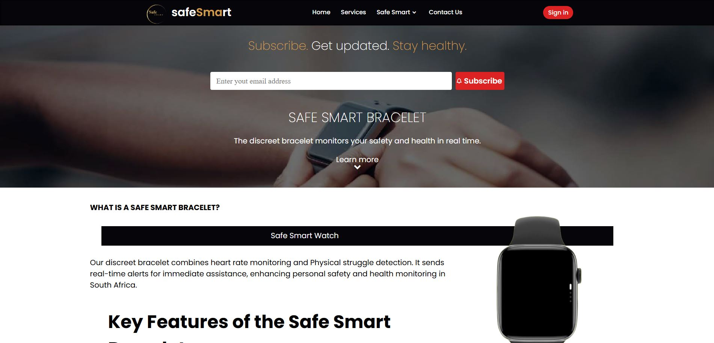
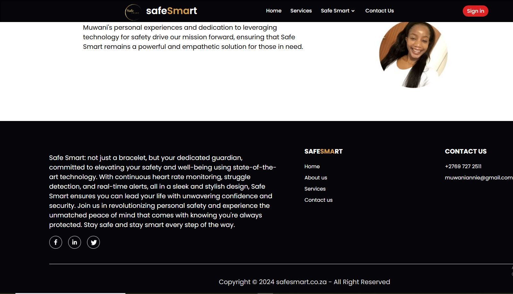
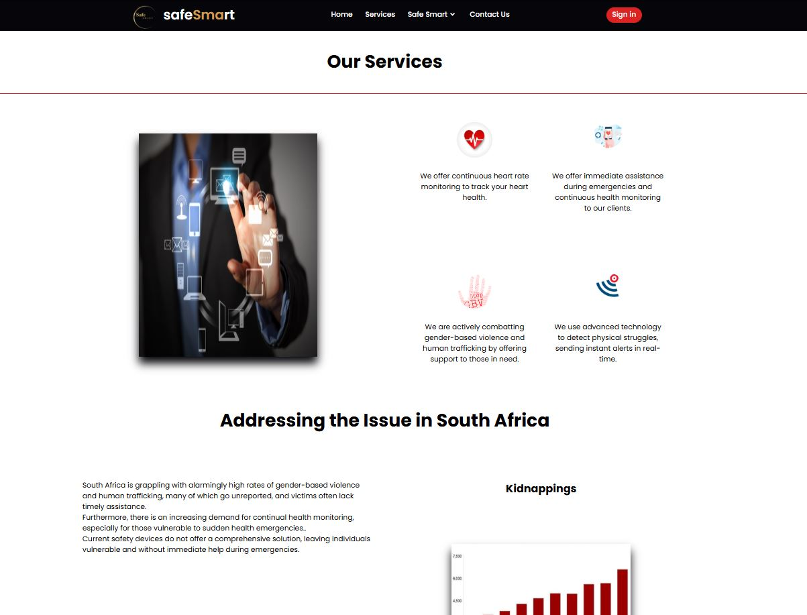
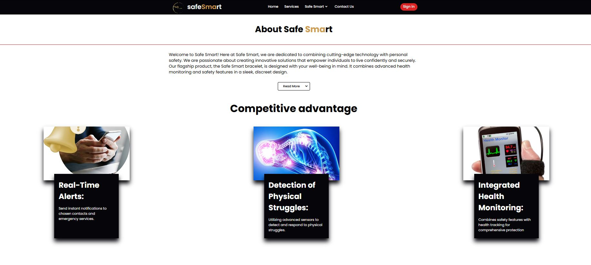
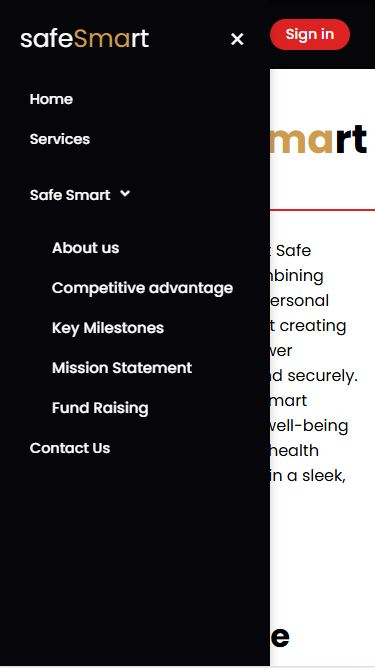

# Responsive Webpage-Intership

This webpage was developed as part of the ALX-Gig-At-Startup program, a 36-hour internship
that challenged me to apply my skills to real-world projects. The project was also integral
 to my skill development program. I was assigned to design and build a website for SafeSmart
  Company, and this webpage showcases my efforts.

## build with 
* HTML
* CSS
* JavaScript
* Node JavaScript
* Mongo DB

## Live demo
[Click Here](https://safesmart.onrender.com) for Live Demo

## Demo images

### Mobile view

